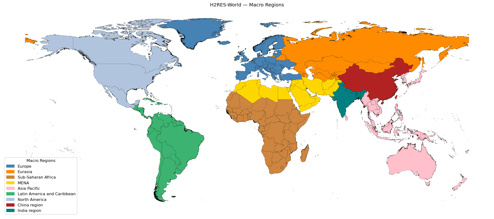

# H2RES-World

This project prepares geospatial zoning for H2RES, separating the world into
layers to enable multi-level energy
modeling and analysis. The target level of disaggregation will be adjusted
based on user requirements, that means, any zone is open for proposed changes.

## Contents

- Notebooks to define country lists, validate coverage, and generate maps
- Supporting data for subregion statistics.
- PDF maps by layer for quick visualization.

## Zero Layer: World Zoning
The next image shows how the H2RES team plan to subdivide the world, on nine macro regions:

